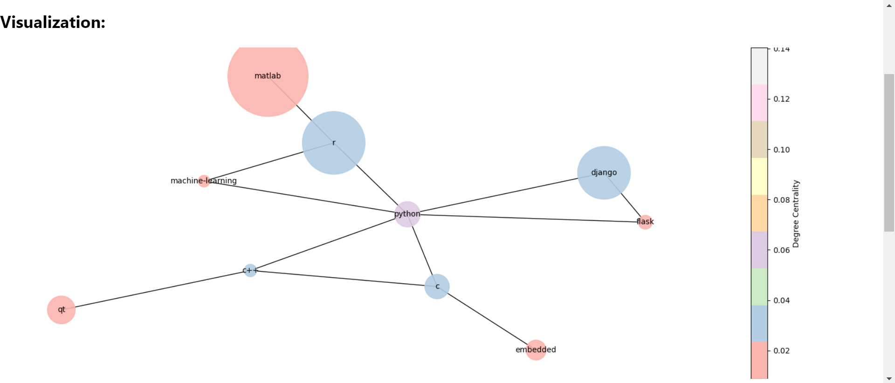

# Stack Overflow Tag Network Analysis
Welcome to the Stack Overflow Tag Network Analysis project repository!

## Overview:
In the age of digital collaboration, this project conducts an in-depth analysis of the Stack Overflow Tag Network dataset, unveiling the intricate relationships among technology tags. The primary goal is to empower developers and programmers by unraveling influential tags, identifying communities, and offering personalized recommendations. Utilizing network analysis, centrality measures, and community detection, the project significantly enhances the user experience within the developer ecosystem.

## Key Features:
1. **Network Analysis**: Comprehensive exploration of tag relationships within the Stack Overflow ecosystem. The constructed network graph consisted of **115 nodes (technology tags) and 235 edges (connections between tags)**, representing the relationships between tags based on their co-occurrence in Stack Overflow questions.

2. **Centrality Measures**: Identification of influential tags through degree, betweenness, and closeness centrality.
   - **Degree Centrality**
     

_Nodes with a high Degree Centrality, such as **jQuery, C#, AngularJS, and others**, were identified as influential within the network. These tags have a significant number of connections and are considered important in shaping the network's structure and dynamics._

  -**Betweenness Centrality**
    

_Tags with high betweenness centrality, including **Linux, MySQL, and others**, were found to be critical for information flow within the network. Disrupting these nodes can significantly impact the network's communication pathways._

 -**Closeness Centrality**
   

_Tags with high closeness centrality, such as **jQuery, MySQL, AngularJS, and others**, were considered central within the network. They are efficient points for information dissemination and resource distribution._

3. **Community Detection**: The dataset was clustered using the Clustering Walktrap algorithm, which efficiently grouped the network into 13 distinct communities. Each community encapsulates a set of related technology tags, fostering a clearer understanding of tag relationships. Within these communities, an analysis identified the most influential nodes based on degree centrality, shedding light on pivotal elements shaping the network dynamics.

4. **Recommendation Engine:** A recommendation engine based on Jaccard similarity was implemented to suggest related tags to users based on their interests and queries. This tool aids users in discovering relevant content within the Stack Overflow ecosystem.

5. **User Interface:** An accessible user interface was created using HTML, CSS, and a Python Flask server, allowing users to interact with community detection and tag recommendation features seamlessly.

 
 

 

## Project Goals:
Enhance discoverability of technology tags on Stack Overflow.
Assist developers and programmers in efficiently finding relevant information.
Foster a more engaging and efficient knowledge-sharing ecosystem.

## File Structure:
- **StackOverflow-dataset:/** The dataset utilized in this project is sourced from Kaggle and comprises the Stack Overflow Tag Network dataset. 
- **static:/** Contains stylesheet and Background Image
- **templates/:** Folder containing HTML, CSS, and Flask code for the user interface.
- **Findings/:** Contains Insights from the project
